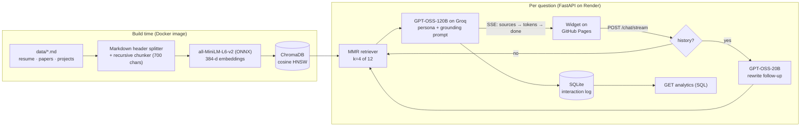

# Ask Saurav: a RAG chatbot that answers as me

[](https://github.com/Saurav2021/ask-saurav/actions/workflows/ci.yml)
[](https://ask-saurav.onrender.com)
[](https://saurav2021.github.io/Portfolio/)


**Ask Saurav** is a retrieval-augmented generation (RAG) chatbot that lets recruiters and professors talk to an AI version of me. It answers in the first person ("I built AURA…"), using only facts retrieved from my resume, research papers and project notes, and it shows the source of every answer.

**Try it:** open my [portfolio](https://saurav2021.github.io/Portfolio/) and click **Ask Saurav** (bottom right), or use the [standalone demo](https://ask-saurav.onrender.com).

<!-- After deploying, record a short GIF of the widget and save it as docs/demo.gif -->
<!--  -->

The whole stack runs on free tiers: Groq's free API, Render's free web service and GitHub Pages.

---

## Skills this project demonstrates

| Area | Where it is in the code |
|---|---|
| **Python, NumPy, Pandas** | Ingestion pipeline, eval scripts, analysis notebook |
| **NLP foundations: tokenization, embeddings, Transformers** | [`notebooks/01_embeddings_and_retrieval.ipynb`](notebooks/01_embeddings_and_retrieval.ipynb): WordPiece tokens, the 256-token limit, cosine-similarity heatmaps |
| **LangChain** | LCEL chains, a history-aware query rewriter, an MMR retriever, prompt templates and streaming ([`app/rag.py`](app/rag.py)) |
| **Vector databases** | Persistent **ChromaDB** in production, benchmarked against **FAISS** in the notebook |
| **SQL** | Every interaction is logged to **SQLite**; `/analytics` runs SQL aggregations with `json_each`, plus a p95 latency query ([`app/db.py`](app/db.py)) |
| **LLM application engineering** | Grounding prompt, persona, prompt-injection and privacy guardrails, graceful failure handling |
| **APIs and deployment** | FastAPI with Server-Sent Events streaming, rate limiting, CORS, Docker, Render, ONNX Runtime |
| **Git, GitHub and testing** | pytest suite (offline, with a fake LLM), ruff, GitHub Actions CI, Render auto-deploy, PR template |
| **Evaluation** | Retrieval Hit@k and MRR gate in CI, plus an answer eval for keyword recall, first-person voice and guardrails |

---

## Architecture



**Why these choices**

- **Header-aware chunking.** Every chunk belongs to exactly one section ("Research: SCRBM › SCRBM results") and has the section title prepended, so the vector carries the topic and citations are readable.
- **MMR retrieval.** Maximal marginal relevance picks 4 chunks out of the 12 nearest, trading a little similarity for diversity, so "Tell me about your research" brings back all three papers rather than three chunks of one.
- **Query rewriting only when needed.** "What FPS does *it* run at?" becomes "What FPS does the AURA pipeline run at?" using a small, fast model, and that LLM call is skipped entirely on the first turn.
- **Two models.** GPT-OSS-120B writes the answers; GPT-OSS-20B (about 1000 tokens/s on Groq) handles rewriting. Both are open-weight models on Groq's free tier, and both can be swapped in `.env`.
- **The index is built at Docker build time,** so a cold start on the free Space only loads files from disk.
- **Stateless server.** The browser sends the last few turns, so no session store is needed and the container can restart freely.

---

## Guardrails

The system prompt ([`app/rag.py`](app/rag.py)) and the eval set ([`eval/guardrails.jsonl`](eval/guardrails.jsonl)) enforce that the bot:

- answers **only from retrieved context**, and for anything else says it hasn't shared that and points to my email;
- speaks **as me in the first person**, but is honest when asked whether it is a bot;
- refuses prompt injection ("ignore previous instructions…") and unrelated tasks;
- never reveals a phone number or details that aren't in the knowledge base;
- never stores raw visitor IPs (only a salted hash), and rate-limits each visitor.

---

## Evaluation

Run on every push by GitHub Actions (results appear in the job summary and as an artifact).

| Eval | What it checks | Command |
|---|---|---|
| Retrieval | Does the correct knowledge-base file appear in the top-k for 28 questions? Reports Hit@1, Hit@4 and MRR. **CI fails if Hit@4 < 0.85.** | `python -m eval.retrieval_eval` |
| Answers | Keyword recall of required facts, first-person voice, and 6 guardrail probes (needs `GROQ_API_KEY`) | `python -m eval.answer_eval` |
| Unit/API | Chunking, streaming event order, history handling, validation, rate limiting, SQL analytics, LLM failure fallback | `pytest` |

<!-- Paste the table from eval/results_retrieval.md here after the first CI run -->

---

## Run it locally

```bash
git clone https://github.com/Saurav2021/ask-saurav.git && cd ask-saurav
python -m venv .venv && source .venv/bin/activate        # Windows: .venv\Scripts\activate
pip install -r requirements-dev.txt
cp .env.example .env                                     # add your free Groq key
python -m app.ingest                                     # builds storage/chroma
uvicorn app.main:app --reload --port 8000                # open http://localhost:8000
```

Interactive API docs are at `http://localhost:8000/docs`.

---

## Deploy for free (about 10 minutes)

1. **Groq key:** sign up at [console.groq.com](https://console.groq.com/keys) (no card needed) and create an API key.
2. **Render:** sign up at [render.com](https://render.com) with GitHub (no card needed). Click **New → Blueprint**, pick this repo, and paste your Groq key when asked for `GROQ_API_KEY`. Render reads [`render.yaml`](render.yaml), builds the Docker image (about 5 minutes the first time) and redeploys on every push to `main`.
3. **Embed the widget** in any site, using your Render URL:
   ```html
   <script src="ask-saurav.js" data-api="https://ask-saurav.onrender.com" defer></script>
   ```
   Any element with `data-ask-saurav` opens the chat; `data-ask-saurav="What is AURA?"` also asks that question.
4. **Optional, keep it warm:** add the repo variable `BACKEND_URL` (your Render URL) and the *Keep chatbot warm* workflow pings `/health` every 10 minutes during the day.

> Render's free tier sleeps after 15 idle minutes and takes about a minute to wake. The widget pings `/health` as soon as the page loads and shows a "waking up" note, so the first visitor isn't left staring at a blank chat. The SQLite log lives in the container, so it resets on each deploy or restart.
>
> **Why fastembed?** The free container has 512 MB of RAM. PyTorch alone would use most of it, so the same all-MiniLM-L6-v2 weights run as ONNX through fastembed, which keeps the whole service small and quick on a tenth of a CPU.

---

## API

| Method | Path | Description |
|---|---|---|
| `POST` | `/chat/stream` | `{question, history?, session_id?}` → `text/event-stream` of `sources`, `token`… and `done` events |
| `POST` | `/chat` | Same input, returns `{answer, sources, latency_ms}` |
| `GET` | `/suggestions` | Starter questions for the widget |
| `GET` | `/health` | Liveness and the models in use |
| `GET` | `/analytics?days=30` | Questions per day, unique visitors, average and p95 latency, most-asked sections (header `X-Admin-Token`) |

---

## Project structure

```
ask-saurav/
├── app/
│   ├── config.py      # every setting, overridable via env vars
│   ├── ingest.py      # Markdown → chunks → embeddings → ChromaDB
│   ├── rag.py         # LangChain chain: rewrite → retrieve (MMR) → grounded streaming answer
│   ├── db.py          # SQLite interaction log + SQL analytics
│   └── main.py        # FastAPI: SSE streaming, rate limiting, CORS, static widget
├── data/              # the knowledge base (edit these to update the bot)
├── frontend/
│   ├── ask-saurav.js  # dependency-free, Shadow-DOM-isolated chat widget
│   └── index.html     # standalone chat page served at /
├── eval/              # retrieval + answer evaluation sets and scripts
├── notebooks/         # tokenization, embeddings, chunk-size sweep, Chroma vs FAISS
├── tests/             # offline pytest suite (fake embeddings + fake LLM)
├── .github/workflows/ # CI + keep-warm ping
├── render.yaml        # one-click free deploy on Render
└── Dockerfile
```

## Updating what the bot knows

Edit the Markdown in `data/` and push. CI re-runs the retrieval eval and the deploy workflow rebuilds the index. Keep each `##` section focused on one topic, because that is the unit of retrieval and citation.

## Roadmap

- Hybrid retrieval (BM25 + dense) with a cross-encoder re-ranker
- LLM-as-judge faithfulness scoring in the answer eval
- Persistent analytics with a free hosted Postgres

---

Built by **Saurav Kumar** · [Portfolio](https://saurav2021.github.io/Portfolio/) · [LinkedIn](https://www.linkedin.com/in/saurav-kumar-299115218/) · sauravsuz@gmail.com
